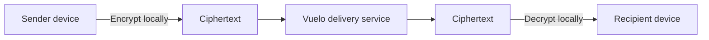

# Server role

English · [Русский](../ru/server-role.md)

Last reviewed: 2026-09-28 
Status: Current

This is a conceptual data-flow diagram. It is not a map of Vuelo's backend implementation.

## What the server needs to do

For a protected one-to-one message, delivery infrastructure needs enough information to authenticate requests, determine conversation membership, route ciphertext to an eligible recipient device, order events, and report delivery acceptance. It can process ciphertext without needing the message plaintext on this code path.

The service also processes account/profile information and device public material for the product's account and routing features.

## What the server does not need to do

The current one-to-one E2EE code path does not require the server to decrypt message content. This is not a statement about group chats, legacy messages, all media, notifications, or every production system.

## Metadata required for delivery

The service may handle account and device identifiers, conversation membership, event kind, sequence and time, and ciphertext size. Network connection metadata may also be visible to infrastructure providers. Actual retention and logging policies have not been verified for this document.

## Current limitations

Group and channel messages, legacy history, and media outside the confirmed encrypted voice path do not share the one-to-one content guarantee. See [security status](security-status.md) and [data and metadata](data-and-metadata.md).
