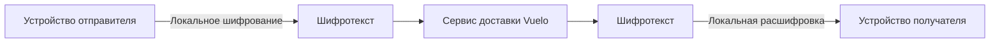

# Роль сервера

[English](../en/server-role.md) · Русский

Последняя проверка: 2026-09-28 
Статус: Актуально

Это концептуальная схема потока данных, а не схема реализации backend Vuelo.

## Что должен делать сервер

Для защищённого сообщения один на один инфраструктуре доставки нужны данные, чтобы аутентифицировать запрос, определить членство в беседе, направить шифротекст подходящему устройству получателя, упорядочить события и подтвердить приём. На этом пути сервер может обработать шифротекст без чтения открытого текста.

Сервис также обрабатывает данные аккаунта и профиля, а также публичные ключи устройств для функций аккаунта и маршрутизации.

## Что серверу не требуется делать

Текущий E2EE-путь один на один не требует расшифровывать содержимое сообщения на сервере. Это не утверждение о группах, старых сообщениях, всех медиа, уведомлениях или каждой production-системе.

## Метаданные, необходимые для доставки

Сервис может обрабатывать идентификаторы аккаунтов и устройств, членство в беседе, тип события, время, последовательность и размер шифротекста. Инфраструктуре также могут быть видны сетевые метаданные. Фактическое хранение и логирование здесь не проверялись.

## Текущие ограничения

Групповые и канальные сообщения, старая история и медиа вне подтверждённого пути голосовых сообщений не имеют той же гарантии содержимого, что и переписка один на один. См. [статус безопасности](security-status.md) и [данные и метаданные](data-and-metadata.md).
